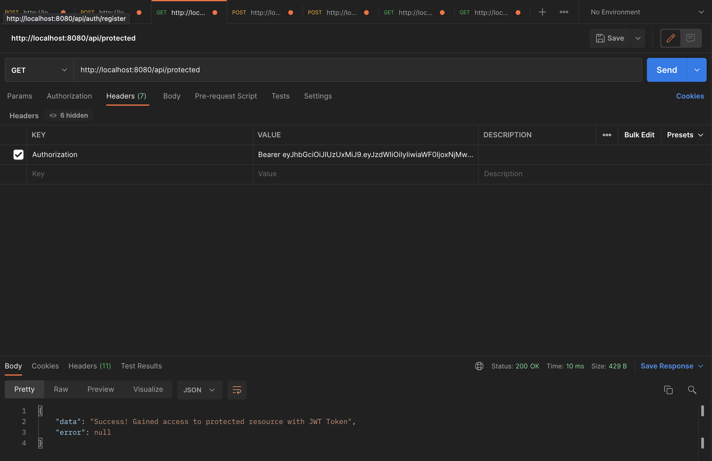

# Spring JWT Authentication

This REST API built with Spring Boot utilizes JSON Web Token and a refresh token.
 
This gives us three levels of security: 

* A digitally signed JWT access token that utilizes the HS512 algorithm and has a lifetime of 1 minute (60000 ms)
* A UUID-generated refresh token that can be used to obtain a new JWT access token, with a lifetime of 5 minutes (300000 ms)
* Username + Password authentication

# Required Tech

Java 11, MySQL 8 or above, Maven, Postman (or another API client), IDE of your choice

# Setup & Launch

* Enter your MySQL password in resources/application.properties file
  
  ``` 
  spring.datasource.password= 
  ```
* Run JwtAuthApplication.java


# Using REST API

## Register a user 

* Navigate to <a href="http://localhost:8080/api/auth/register">localhost:8080/api/auth/register</a> using Postman.

* Register a new user by issuing a POST request with a body like so:


## Login 

* Issue a POST request with user  credentials to endpoint: <a href="http://localhost:8080/api/auth/login">localhost:8080/api/auth/login</a>


## Test access token

Copy the access token that was returned in the body of the response after successful login. 

This token is valid for 60 seconds.

Go ahead and check that you can gain access to the protected endpoint:

* Add an Authorization Header with the token and "Bearer " in front of it

* Issue a GET request to <a href="http://localhost:8080/api/protected">localhost:8080/api/protected</a> 



## Refresh access token

After five minutes, the access token is no longer valid, and you'll get a 401 Unauthorized error.

It's time to refresh your access using the access token!

* Issue a POST request to <a href="http://localhost:8080/api/auth/refresh-access">localhost:8080/api/auth/refresh-access</a> with the refresh token in the body

* If the refresh token is non-expired, you'll get a new access token in the response.

* If expired, you'll be prompted to login again for a new refresh token.


## Logout 
* Issue a POST request to http://localhost:8080/api/auth/logout/{userId} where userId is the Id of the user to be logged out.

* This will delete any refresh tokens currently in the DB associated with the user

# Credits 

A HUGE thank you to the following awesome people and their tutorials that helped me navigate the world of JWT and create this project

* https://www.bezkoder.com/spring-boot-jwt-authentication/
* https://www.callicoder.com/series/spring-security-react/
* Coding Nomads (special thanks to Ryan and Jared)

# Disclaimer

This application is an exploration of JWT Auth and Spring Security, and should not be used in a professional setting unless it's heavily tested and modified to ensure the security of a project.

# Got Questions? Contact me!
efim@shulginmusic.com
